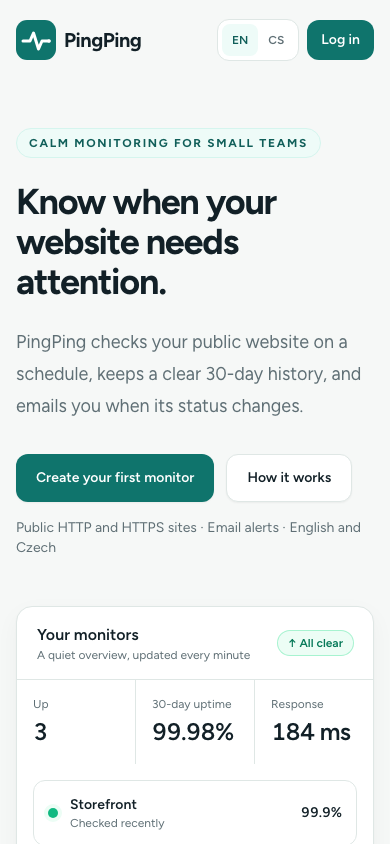
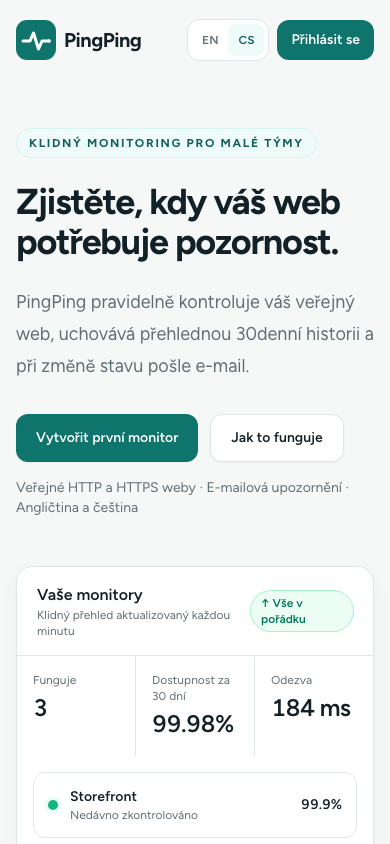
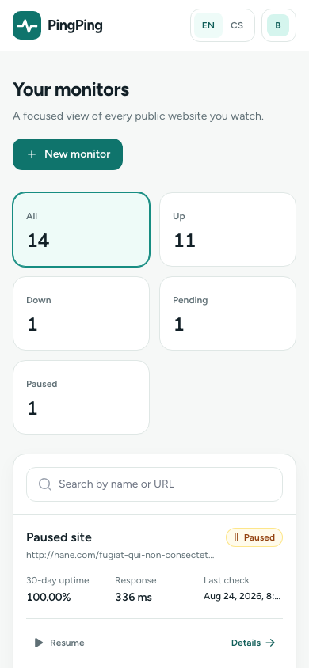
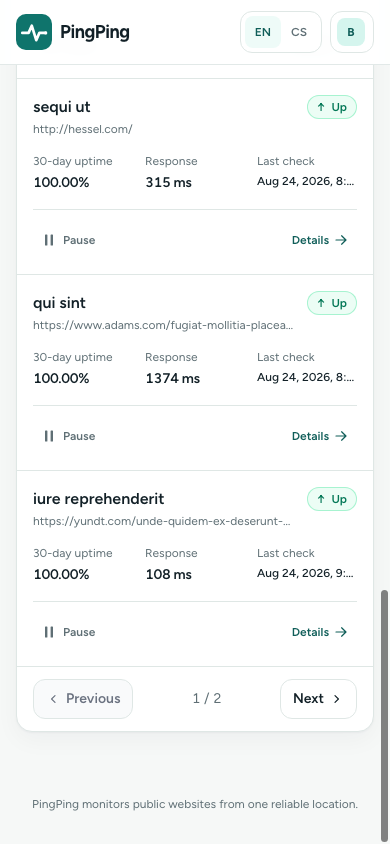
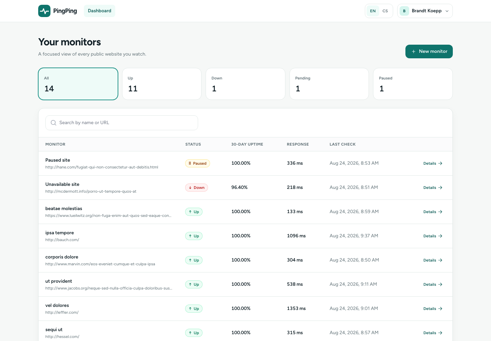
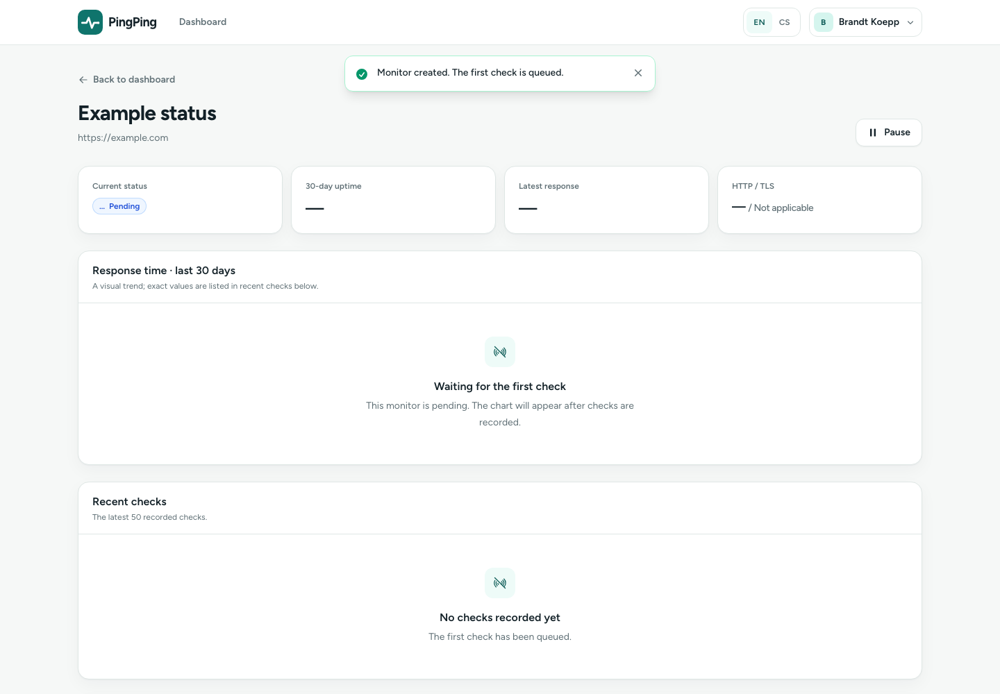
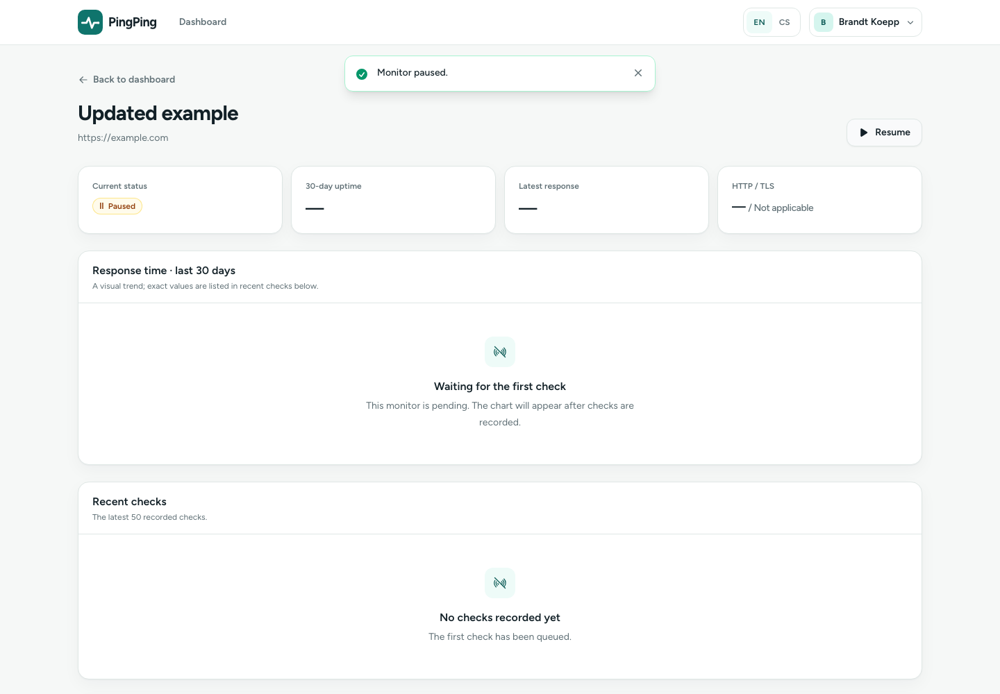
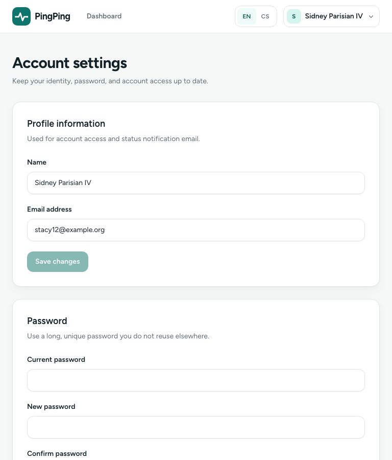

# PingPing verification record

Date: 2026-08-24
Status: Passed for the requested scope

All evidence below was produced from the final worktree on the date above. The browser suite uses an isolated SQLite database and Chrome 151.

## Automated gates

| Gate | Command | Result |
| --- | --- | --- |
| Fresh schema and representative data | `DB_CONNECTION=sqlite DB_DATABASE=database/dusk.sqlite php artisan migrate:fresh --seed --force` | Passed; all migrations and seeders completed without deleting or altering the normal development database |
| PHP suite | `php artisan test --compact` | Passed: 69 tests, 237 assertions |
| Browser journeys | `php artisan dusk --without-tty` | Passed: 3 journeys, 28 assertions |
| Production assets | `npm run build` | Passed with Vite 7.3.6; 1,456 modules transformed |
| PHP formatting | `vendor/bin/pint --test` | Passed: 100 files |
| Composer metadata | `composer validate --strict` | Passed |
| PHP platform | `composer check-platform-reqs` | Passed, including cURL and OpenSSL |
| PHP advisories | `composer audit --locked` | No vulnerability advisories |
| npm advisories | `npm audit --audit-level=high` | 0 vulnerabilities |
| Scheduler | `php artisan schedule:list` | One `PingMonitorsJob` entry, due every minute |
| Patch hygiene | `git diff --check` | Passed |

## Flow and regression coverage

- Authentication: registration, login, logout, password confirmation, password reset, password update, and mandatory email verification.
- Monitoring access: verified-only routes and cross-user 403 responses for show, update, toggle, and delete.
- Dashboard: account-global counts, search, status filters, pagination, desktop table, mobile cards, and mobile pagination.
- Monitor lifecycle: public-target validation, creation into pending state, immediate job dispatch, update, pause, resume, target reset, and deletion with flash feedback.
- Monitoring boundary: public IPv4/IPv6 enforcement, DNS resolution, DNS pinning, credentials/scheme/port restrictions, private/reserved/link-local/multicast rejection, redirect revalidation, five-hop cap, retry behavior, timeouts, TLS failures, status handling, 30-day uptime, first-check behavior, unique jobs, overlap protection, and due-interval dispatch.
- Localization: persisted English/Czech user locale, bilingual server/UI catalogs, and Czech queued notification mail.
- Schema safety: migration up/down round trip retains users, monitors, logs, and converted values.
- Error handling: production 403 and 404 responses render the branded Inertia error component while preserving the HTTP status.

## Accessibility and interaction review

The Dusk journeys run axe-core after the major public, authentication, dashboard, create, detail, profile, and open-dialog states. No serious or critical violations were reported. The reviewed implementation also provides:

- visible focus rings and a skip link;
- native modal focus trapping and Escape handling, with explicit dialog names/descriptions;
- labels, inline `role="alert"` validation, polite flash announcements, and accessible icon names;
- status glyphs and text in addition to color;
- a screen-reader table alternative for the response chart;
- reduced-motion CSS and chart behavior;
- keyboard-operable native buttons, links, disclosures, fields, and dialogs.

Dusk writes non-empty browser console output into `tests/Browser/console`. The final run created no log files, so no browser errors or warnings were observed on the tested journeys.

## Responsive visual review

Chrome device-metric overrides make the screenshots exact viewport captures rather than approximate window sizes. The captures were manually inspected for overflow, hierarchy, readable density, focus/action visibility, and state clarity.

- 390px: English and Czech landing pages keep language and login visible; the primary registration action remains in the hero. The mobile dashboard uses cards and exposes working pagination.
- 768px: account settings remain compact, readable, and single-column without oversized controls.
- 1440px: global counts, search, status labels, table density, pending/paused empty history, flash feedback, and detail hierarchy remain clear.

## Operational follow-up

No code blocker remains. A deployment still needs environment-specific checks that cannot be proven locally: back up the production database, stop old scheduler/workers during the schema change, configure a real mail transport, run the migration, restart workers, and smoke-test one safe public monitor and one real notification. Automatic log retention, multi-region monitoring, one-minute checks, SMS, Slack, webhooks, and dark mode remain intentionally out of scope.
